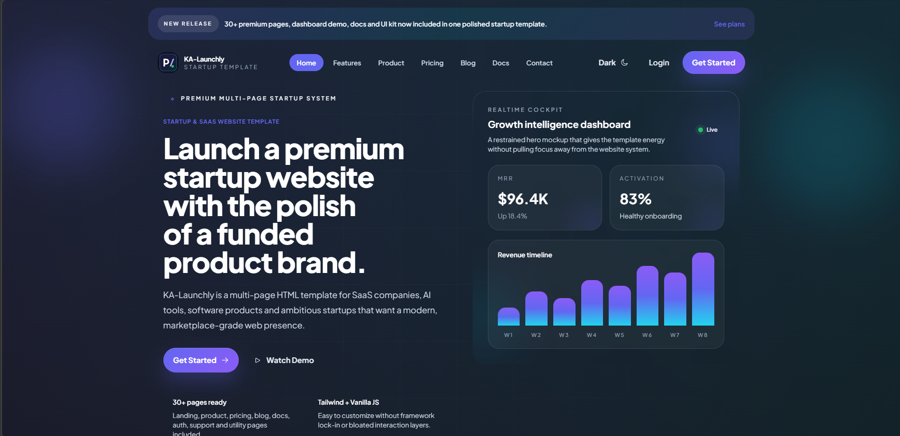

# KA-Launchly – Startup & SaaS Website Template

KA-Launchly is a modern **Startup & SaaS website template** designed for technology startups, SaaS platforms, AI tools and digital products.
It provides a clean and premium user interface with a fully responsive layout and a scalable component system.

Built with **HTML5, TailwindCSS and Vanilla JavaScript**, KA-Launchly is lightweight, easy to customize and suitable for modern product websites.

---

---

## 🚀 Live Demo

**Preview the template:**

https://demo.kodatolye.com.tr/ka-launchly/

---

## 📸 Screenshot

---

## ✨ Features

• Modern Startup & SaaS Design
• 30+ Ready HTML Pages
• Fully Responsive Layout
• Dark & Light Mode Support
• TailwindCSS Based UI System
• Clean and Well-Structured Code
• SEO Friendly HTML Structure
• Fast Loading & Optimized Performance
• Reusable UI Components
• Pricing Tables
• Testimonials Sections
• FAQ (Accordion) Components
• Form & Input Components
• Sticky Navigation
• Smooth Scroll Animations
• Hover Micro Interactions
• Feature Grid Sections
• Product Showcase Layouts
• Integration Sections
• Blog Pages
• Documentation Pages
• Authentication Pages (Login / Register)
• 404 & Utility Pages
• Easy Customization
• Framework Independent Structure

---

## 📄 Included Pages

KA-Launchly includes **30+ ready HTML pages**.

### Landing Pages

• Home Landing
• Startup Landing
• SaaS Landing
• AI Product Landing
• Mobile App Landing

### Product Pages

• Features Page
• Product Overview
• Integrations Page
• Use Cases Page
• Roadmap Page

### Pricing

• Pricing Page
• Pricing Comparison
• Pricing FAQ

### Blog

• Blog List
• Blog Grid
• Blog Article

### Documentation

• Docs Home
• Getting Started
• API Documentation
• Changelog

### Authentication

• Login Page
• Register Page
• Forgot Password
• Reset Password

### Company Pages

• About Page
• Careers Page
• Contact Page
• Support Page

### Utility Pages

• 404 Page
• Maintenance Page

---

## 🧰 Technologies Used

HTML5
TailwindCSS
Vanilla JavaScript
Alpine.js
Swiper.js
Chart.js
Font Awesome
Google Fonts (Inter / Plus Jakarta Sans)

---

## 📁 Project Structure

ka-launchly/

assets/
  css/
  js/
  img/

pages/
  blog/
  docs/
  auth/

index.html
README.md
LICENSE

---

## ⚙️ Customization

KA-Launchly is designed with a **clean and developer-friendly structure**.
You can easily customize colors, layouts and components.

Using TailwindCSS makes it simple to:

• Change colors and styles
• Modify layouts
• Create new UI components
• Expand existing pages

---

## 📱 Responsive Design

The template is fully responsive and works perfectly on:

• Desktop devices
• Tablets
• Mobile phones

Every layout adapts smoothly to different screen sizes.

---

## 🎯 Suitable For

KA-Launchly is ideal for:

• Startup websites
• SaaS platforms
• AI tools
• Software products
• Mobile app landing pages
• Tech startups
• Digital product launches
• Web agencies and developers

---

## 📜 License

KA-Launchly is a **free template** provided by Kod Atölye.

You may use this template for **personal and commercial projects**.

However:

• Reselling the template is not allowed
• Redistributing the template as a product is not allowed
• Publishing it on other marketplaces is not allowed

---

## 🌐 Author

Developed by **Kod Atölye**

Website
https://kodatolye.com.tr

Demo
https://demo.kodatolye.com.tr/ka-launchly/

---

## ⭐ Support the Project

If you like this template, please consider giving it a **star on GitHub**.
It helps the project reach more developers and startups.
